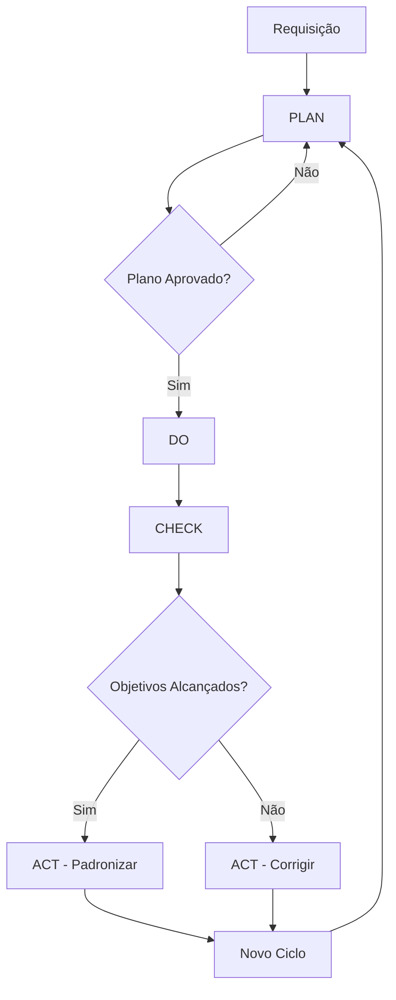

# 🔄 Guardian com Metodologia PDCA

## 📋 Visão Geral

Transformar o Guardian Orchestrator em um agente focado na metodologia PDCA (Plan-Do-Check-Act) para melhoria contínua do projeto.

## 🎯 O que é PDCA?

**P**lan (Planejar) → **D**o (Fazer) → **C**heck (Verificar) → **A**ct (Agir)

Um ciclo contínuo de melhoria que garante evolução constante e correção de problemas de forma sistemática.

## 🏗️ Implementação no Guardian

### 1️⃣ PLAN (Planejar)
```typescript
class GuardianPDCA {
    async plan(request: string): Promise<PDCAPlan> {
        // Analisar requisição
        const analysis = await this.analyzeRequest(request);
        
        // Definir objetivos SMART
        const objectives = this.defineObjectives(analysis);
        
        // Criar plano detalhado
        return {
            objectives,
            tasks: this.breakdownTasks(objectives),
            metrics: this.defineMetrics(objectives),
            timeline: this.estimateTimeline(),
            resources: this.identifyResources(),
            risks: this.assessRisks()
        };
    }
}
```

**Características do PLAN:**
- 📊 Análise detalhada da situação atual
- 🎯 Objetivos claros e mensuráveis
- 📋 Tarefas específicas com responsáveis
- ⏱️ Cronograma realista
- 📈 Métricas de sucesso definidas

### 2️⃣ DO (Fazer)
```typescript
async do(plan: PDCAPlan): Promise<PDCAExecution> {
    const execution = {
        startTime: new Date(),
        tasks: [],
        logs: []
    };
    
    // Executar tarefas em ordem otimizada
    for (const task of plan.tasks) {
        // Delegar para especialista apropriado
        const specialist = this.selectSpecialist(task);
        
        // Registrar início
        await this.logTaskStart(task);
        
        // Executar
        const result = await specialist.execute(task);
        
        // Registrar resultado
        execution.tasks.push({
            task,
            result,
            duration: Date.now() - task.startTime
        });
    }
    
    return execution;
}
```

**Características do DO:**
- 🚀 Execução sistemática
- 📝 Registro detalhado de ações
- 🤝 Delegação inteligente
- ⏰ Monitoramento em tempo real
- 💾 Persistência de resultados

### 3️⃣ CHECK (Verificar)
```typescript
async check(plan: PDCAPlan, execution: PDCAExecution): Promise<PDCACheck> {
    const check = {
        metricsAchieved: {},
        deviations: [],
        learnings: [],
        performance: {}
    };
    
    // Comparar resultados com métricas planejadas
    for (const metric of plan.metrics) {
        const actual = await this.measureMetric(metric, execution);
        const expected = metric.target;
        
        check.metricsAchieved[metric.name] = {
            expected,
            actual,
            achieved: this.isMetricAchieved(expected, actual),
            deviation: this.calculateDeviation(expected, actual)
        };
    }
    
    // Identificar desvios
    check.deviations = this.identifyDeviations(plan, execution);
    
    // Extrair aprendizados
    check.learnings = await this.extractLearnings(execution);
    
    // Análise de performance
    check.performance = this.analyzePerformance(execution);
    
    return check;
}
```

**Características do CHECK:**
- 📊 Comparação objetiva com plano
- 📈 Medição de métricas
- 🔍 Identificação de desvios
- 💡 Extração de aprendizados
- 📉 Análise de performance

### 4️⃣ ACT (Agir)
```typescript
async act(check: PDCACheck): Promise<PDCAActions> {
    const actions = {
        improvements: [],
        corrections: [],
        standardizations: [],
        nextCycle: null
    };
    
    // Ações corretivas para desvios
    for (const deviation of check.deviations) {
        if (deviation.severity > 0.3) {
            actions.corrections.push(
                this.createCorrectiveAction(deviation)
            );
        }
    }
    
    // Melhorias baseadas em aprendizados
    for (const learning of check.learnings) {
        if (learning.impact > 0.5) {
            actions.improvements.push(
                this.createImprovement(learning)
            );
        }
    }
    
    // Padronizar sucessos
    const successes = this.identifySuccesses(check);
    for (const success of successes) {
        actions.standardizations.push(
            this.createStandardization(success)
        );
    }
    
    // Preparar próximo ciclo
    actions.nextCycle = this.prepareNextCycle(check);
    
    return actions;
}
```

**Características do ACT:**
- 🔧 Ações corretivas imediatas
- 📈 Melhorias contínuas
- 📋 Padronização de sucessos
- 🔄 Preparação do próximo ciclo
- 💾 Documentação de mudanças

## 📊 Fluxo Completo PDCA



## 💡 Exemplos Práticos

### Exemplo 1: Organização de Documentação
```yaml
PLAN:
  - Objetivo: Organizar 100% dos docs em 7 dias
  - Métricas: % arquivos organizados, tempo gasto
  - Tarefas: Análise, categorização, movimentação

DO:
  - Executar Cleanup Specialist
  - Mover arquivos para estrutura nova
  - Remover duplicatas

CHECK:
  - 95% organizados ✅
  - Tempo: 5 dias (2 dias antes) ✅
  - 3 arquivos problemáticos ⚠️

ACT:
  - Padronizar estrutura de pastas
  - Criar script para organização automática
  - Investigar 3 arquivos problemáticos
```

### Exemplo 2: Otimização de Performance
```yaml
PLAN:
  - Objetivo: Reduzir tempo de build em 50%
  - Métricas: Tempo de build, uso de CPU
  - Tarefas: Profiling, otimização, cache

DO:
  - Analisar com Performance Specialist
  - Implementar cache de dependências
  - Paralelizar processos

CHECK:
  - Redução: 45% ⚠️
  - CPU: -30% ✅
  - Novos gargalos identificados

ACT:
  - Manter otimizações implementadas
  - Novo ciclo focado nos gargalos
  - Documentar configurações de cache
```

## 🛠️ Integração com Especialistas

```typescript
// Guardian PDCA coordena especialistas
const specialists = {
    cleanup: 'Análise e organização',
    docker: 'Otimização de containers',
    nextjs: 'Performance frontend',
    security: 'Verificação de segurança'
};

// Cada especialista reporta no formato PDCA
interface SpecialistReport {
    planned: Metric[];
    executed: Action[];
    measured: Result[];
    recommendations: Improvement[];
}
```

## 📈 Benefícios da Abordagem PDCA

1. **Melhoria Contínua**: Cada ciclo traz evolução
2. **Decisões Baseadas em Dados**: Métricas objetivas
3. **Aprendizado Sistemático**: Documentação de lições
4. **Correção Rápida**: Desvios identificados cedo
5. **Padronização**: Sucessos replicados

## 🚀 Implementação Proposta

### Fase 1: Estrutura Base
```typescript
// guardian-pdca.ts
export class GuardianPDCA extends GuardianOrchestrator {
    private cycles: Map<string, PDCACycle> = new Map();
    
    async processPDCA(request: string): Promise<void> {
        // 1. PLAN
        const plan = await this.plan(request);
        
        // 2. DO
        const execution = await this.do(plan);
        
        // 3. CHECK
        const check = await this.check(plan, execution);
        
        // 4. ACT
        const actions = await this.act(check);
        
        // Salvar ciclo
        this.saveCycle({ plan, execution, check, actions });
        
        // Iniciar novo ciclo se necessário
        if (actions.nextCycle) {
            await this.processPDCA(actions.nextCycle);
        }
    }
}
```

### Fase 2: Métricas e KPIs
- Score de organização do projeto
- Tempo de resposta a requisições
- Taxa de sucesso de tarefas
- Número de melhorias implementadas
- Redução de problemas recorrentes

### Fase 3: Dashboard PDCA
```typescript
// Visualização dos ciclos
interface PDCADashboard {
    currentCycle: PDCACycle;
    historicalCycles: PDCACycle[];
    metrics: {
        improvementRate: number;
        cycleTime: number;
        successRate: number;
    };
    trends: TrendAnalysis;
}
```

## 📋 Comandos PDCA

```bash
# Iniciar ciclo PDCA
guardian pdca start "Melhorar organização do projeto"

# Ver status do ciclo atual
guardian pdca status

# Histórico de ciclos
guardian pdca history

# Métricas de melhoria
guardian pdca metrics

# Forçar verificação
guardian pdca check

# Aplicar ações
guardian pdca act
```

## 🎯 Métricas de Sucesso

1. **Redução de Problemas**: -50% em 3 meses
2. **Tempo de Ciclo**: < 1 semana
3. **Taxa de Melhoria**: > 10% por ciclo
4. **Satisfação**: Score > 8/10

---

**Conclusão**: O Guardian com PDCA transformará a gestão do projeto em um processo de melhoria contínua, sistemático e mensurável!