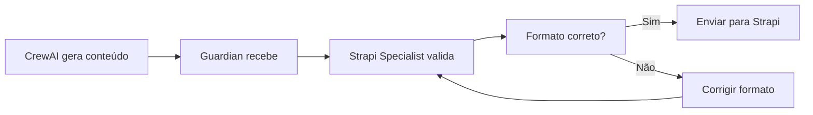

# Plano de Integração: CrewAI + Strapi + Frontend

## 🎯 Objetivo
Integrar o sistema de criação automatizada de conteúdo usando os agentes especialistas disponíveis.

## 🤖 Agentes Envolvidos

### 1. Guardian Orchestrator (Coordenador)
- **Papel**: Supervisionar e coordenar todos os agentes
- **Responsabilidades**:
  - Monitorar o processo de criação de conteúdo
  - Delegar tarefas aos especialistas
  - Agregar resultados
  - Registrar métricas e logs

### 2. Strapi Specialist
- **Papel**: Gerenciar a integração com o CMS
- **Responsabilidades**:
  - Validar estrutura dos content-types
  - Garantir que os dados estejam no formato correto
  - Monitorar criação de posts
  - Troubleshooting de erros da API

### 3. NextJS Specialist  
- **Papel**: Otimizar o frontend
- **Responsabilidades**:
  - Verificar se o strapiClient.ts está otimizado
  - Implementar cache e revalidação
  - Garantir que os posts apareçam corretamente
  - Otimizar performance de carregamento

### 4. Docker Specialist
- **Papel**: Gerenciar infraestrutura
- **Responsabilidades**:
  - Monitorar containers do Strapi
  - Otimizar configurações
  - Garantir estabilidade do sistema

## 📋 Fluxo de Trabalho

### Fase 1: Preparação


### Fase 2: Criação
1. **CrewAI** gera artigo sobre criptomoedas
2. **Guardian** recebe e registra no log
3. **Strapi Specialist** valida campos obrigatórios
4. **Script Python** (`strapi_integration.py`) envia para API
5. **Guardian** monitora resposta

### Fase 3: Publicação
1. **Strapi** retorna sucesso com ID e slug
2. **NextJS Specialist** verifica cache
3. **Frontend** atualiza automaticamente
4. **Guardian** registra métricas

## 🛠️ Implementação Técnica

### 1. Webhook Server para CrewAI
```bash
# Iniciar servidor que recebe posts do CrewAI
node scripts/strapi-post-manager.js webhook-server --port 3001
```

### 2. Pipeline do CrewAI
```python
# framework_crewai/blog_crew/strapi_integration.py
from strapi_integration import CrewAIAdapter

adapter = CrewAIAdapter()
crew_output = crew.execute()  # CrewAI gera conteúdo
results = adapter.process_crew_output(crew_output)
```

### 3. Guardian Monitora
```typescript
// Guardian registra e supervisiona
guardian.notify_start('crew_content_creation', total_posts)
guardian.notify_progress('crew_content_creation', current, total)
guardian.notify_complete('crew_content_creation', stats)
```

### 4. Frontend Consome
```typescript
// strapiClient.ts busca novos posts
const posts = await strapiClient.getPosts({
  sort: 'publishedAt:desc',
  status: 'published'
});
```

## 📊 Métricas de Sucesso

- ✅ Posts criados automaticamente
- ✅ Tempo médio de criação < 5 segundos
- ✅ Taxa de sucesso > 95%
- ✅ Posts aparecem no frontend em < 1 minuto
- ✅ Logs completos no Guardian

## 🚀 Comandos de Execução

### 1. Testar Integração Manual
```bash
# Criar post de teste
python framework_crewai/blog_crew/strapi_integration.py test
```

### 2. Iniciar Pipeline Automático
```bash
# Terminal 1: Webhook server
node scripts/strapi-post-manager.js webhook-server

# Terminal 2: CrewAI pipeline
cd framework_crewai/blog_crew
python main.py simple-pipeline --limit 5
```

### 3. Monitorar com Guardian
```bash
# Ver logs do Guardian
curl http://localhost:8000/api/logs

# Ver estatísticas
curl http://localhost:8000/api/stats
```

## 🔧 Configurações Necessárias

### .env.local
```env
NEXT_PUBLIC_STRAPI_URL=https://ale-blog.agentesintegrados.com
STRAPI_API_TOKEN=87e5f7e4c6917d39415f669f077cafa528e26c3aff065206805c82daa7e6ede2941bb783992ab6a8fc0f31f45b239dce9915b8a161d41ff312529464da6f9501218cb15b375253cfad94df96fb61286ca4e96558dfc37d36bbdb58214fd7bf76dcec1c61a3c7c1d9d00d541dc14c7d158463432f252708b9b421a02f65e0defb
```

### framework_crewai/.env
```env
STRAPI_URL=https://ale-blog.agentesintegrados.com
STRAPI_API_TOKEN=87e5f7e4c6917d39415f669f077cafa528e26c3aff065206805c82daa7e6ede2941bb783992ab6a8fc0f31f45b239dce9915b8a161d41ff312529464da6f9501218cb15b375253cfad94df96fb61286ca4e96558dfc37d36bbdb58214fd7bf76dcec1c61a3c7c1d9d00d541dc14c7d158463432f252708b9b421a02f65e0defb
GUARDIAN_API_URL=http://localhost:8000
```

## 📈 Próximos Passos

1. **Configurar CrewAI** para gerar conteúdo sobre criptomoedas
2. **Ativar Guardian** para monitoramento em tempo real
3. **Testar pipeline** end-to-end
4. **Ajustar prompts** do CrewAI baseado nos resultados
5. **Implementar agendamento** para posts automáticos diários