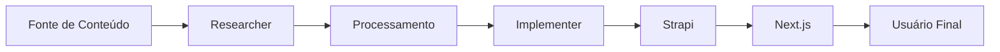

# 🚀 Plano de Migração Strapi → Strapi

## 🎯 Filosofia do Projeto
- **claude-diego-flow**: Diego dá o flow aos agentes, trabalho em equipe sem vaidade
- **Qualidade sobre velocidade**: Usar pensamento sequencial quando necessário
- **Foco no que é bom de verdade**: Sem firulas, apenas o que funciona

## 📊 Status Atual

### ✅ O que já está pronto:
- Strapi rodando em Docker (PostgreSQL + Strapi)
- Subdomínio público configurado: https://ale-blog.agentesintegrados.com
- Content-Types criados (Post, Author, Page)
- Scripts de migração preparados
- Estrutura básica do projeto organizada

### ❌ O que falta fazer:
- Admin do Strapi não configurado (sem usuário criado)
- APIs públicas não habilitadas
- Dados não migrados
- Integração Next.js não testada

## 📋 Tarefas Imediatas (Deixar Funcional)

### 1. Configuração Manual do Admin Strapi
**Responsável**: Guardian (com ajuda do usuário)
**Tempo estimado**: 15 minutos

```bash
# Passos:
1. Acessar https://ale-blog.agentesintegrados.com/admin
2. Criar primeiro usuário administrador
3. Salvar credenciais com segurança
4. Gerar token de API para automação
```

### 2. Ativar APIs Públicas
**Responsável**: Implementer
**Tempo estimado**: 10 minutos

```bash
# Após ter o token de admin:
cd /home/strapi/thecryptofrontier/strapi/scripts
export STRAPI_ADMIN_TOKEN="seu-token-aqui"
export STRAPI_URL="https://ale-blog.agentesintegrados.com"
node setup-public-permissions.js
```

### 3. Popular Dados de Exemplo
**Responsável**: Researcher + Implementer
**Tempo estimado**: 30 minutos

```bash
# Migrar dados do Strapi:
node migrate-from-strapi.js

# Ou criar dados de exemplo:
node migrate-sample-data.js
```

### 4. Integração Next.js
**Responsável**: Coordinator + Implementer
**Tempo estimado**: 1 hora

```javascript
// Atualizar /src/lib/strapiClient.js
const STRAPI_URL = process.env.NEXT_PUBLIC_STRAPI_URL || 'https://ale-blog.agentesintegrados.com';

// Testar endpoints:
// - /api/posts?populate=*
// - /api/authors?populate=*
// - /api/pages?populate=*
```

## 🔄 Melhorias de Médio Prazo

### 1. Sistema de Orquestração Multi-Agente
**Objetivo**: Integrar claude-flow-diego para automação inteligente

```yaml
# Estrutura proposta:
guardian:
  - monitora saúde do sistema
  - coordena outros agentes
  - garante qualidade

researcher:
  - analisa conteúdo existente
  - sugere melhorias
  - busca novas fontes

implementer:
  - executa migrações
  - aplica correções
  - mantém código limpo

coordinator:
  - gerencia fluxo de trabalho
  - sincroniza agentes
  - reporta progresso
```

### 2. Comunicação Entre Agentes
**Usando MCP (Model Context Protocol)**:
- Mem0 para memória persistente entre agentes
- Docker tools para gerenciar containers
- GitHub tools para versionamento

### 3. Testes Automatizados
```javascript
// tests/migration.test.js
describe('Migração Strapi->Strapi', () => {
  test('Content-Types criados corretamente');
  test('Dados migrados com integridade');
  test('APIs públicas acessíveis');
  test('Next.js renderiza conteúdo');
});
```

## 🌟 Visão de Longo Prazo

### 1. Pipeline de Conteúdo Automatizado


### 2. Evolução Contínua
- **Feedback Loop**: Agentes aprendem com erros
- **Melhoria Incremental**: Pequenas mudanças constantes
- **Documentação Viva**: Atualizada automaticamente

### 3. Métricas de Qualidade
- Tempo de resposta das APIs
- Taxa de sucesso das migrações
- Satisfação do usuário final
- Cobertura de testes

## 🤝 Como os Agentes se Ajudam

### Guardian → Researcher
"Detectei lentidão na API de posts, pode investigar?"

### Researcher → Implementer
"Encontrei um padrão melhor para estruturar os dados, pode implementar?"

### Implementer → Coordinator
"Migração concluída, pode validar e publicar?"

### Coordinator → Guardian
"Deploy realizado, pode monitorar a saúde?"

## 🚦 Próximos Passos Imediatos

1. **AGORA**: Criar admin no Strapi (manual)
2. **EM 30 MIN**: Ativar APIs públicas
3. **EM 1 HORA**: Popular dados
4. **HOJE**: Testar integração completa

## 📝 Notas Importantes

- **Sem pressa**: Melhor fazer certo do que rápido
- **Comunicação clara**: Documentar decisões
- **Trabalho em equipe**: Nenhum agente trabalha sozinho
- **Foco no usuário**: Tudo que fazemos é para melhorar a experiência

---

*"Diego dá o flow, os agentes executam com excelência"* 🌊