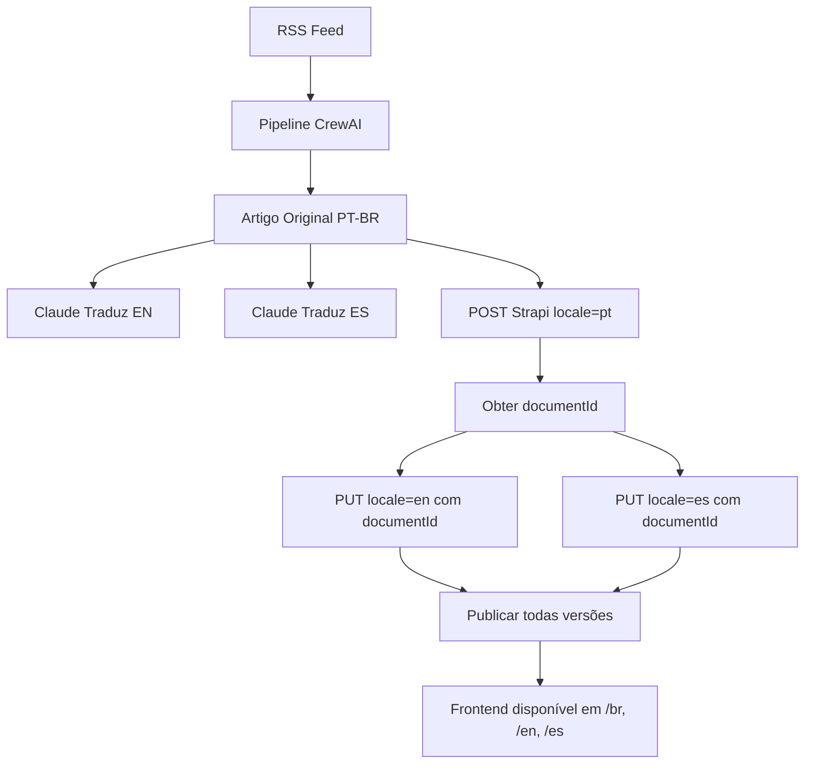

# Integração i18n Completa: Strapi + Frontend

## 📚 Informações do Especialista em Strapi

### 1. Configuração do Plugin i18n no Strapi
- **Ativar em:** Settings > Global Settings > Internationalization
- **Locales disponíveis:** Mais de 500 pré-definidos
- **Limitação:** Não é possível criar locales customizados

### 2. Habilitação em Content-Types
- Marcar "Internationalization" nas configurações avançadas
- Possível habilitar localização campo a campo

### 3. API Endpoints para i18n

#### Criar conteúdo no locale padrão:
```json
POST /api/posts
{
  "data": {
    "title": "Título em Português",
    "content": "Conteúdo..."
  }
}
```

#### Criar conteúdo em locale específico:
```json
POST /api/posts
{
  "data": {
    "title": "English Title",
    "content": "Content...",
    "locale": "en"
  }
}
```

#### Atualizar/criar versão em outro idioma:
```json
PUT /api/posts/{documentId}?locale=es
{
  "data": {
    "title": "Título en Español",
    "content": "Contenido..."
  }
}
```

### 4. Publicação por Idioma
- Cada versão deve ser publicada separadamente
- Use `locale: '*'` para publicar todas as versões:

```javascript
// Publicar versão específica
await strapi.documents('api::post.post').publish({
  documentId: 'abc123',
  locale: 'en'
});

// Publicar todas as versões
await strapi.documents('api::post.post').publish({
  documentId: 'abc123',
  locale: '*'
});
```

## 🔄 Integração Frontend-Backend

### 1. Buscar Post com Todas as Versões
```javascript
// Frontend: pages/[locale]/posts/[slug].tsx
export async function getStaticProps({ params }) {
  const { locale, slug } = params;
  
  // Buscar post no idioma atual
  const postRes = await fetch(
    `${STRAPI_URL}/api/posts?filters[slug][$eq]=${slug}&locale=${locale}`
  );
  const postData = await postRes.json();
  const post = postData.data[0];
  
  if (!post) {
    return { notFound: true };
  }
  
  // Buscar todas as versões para hreflang
  const allVersionsRes = await fetch(
    `${STRAPI_URL}/api/posts/${post.documentId}?locale=all`
  );
  const allVersions = await allVersionsRes.json();
  
  return {
    props: {
      post,
      alternates: allVersions.data.map(v => ({
        locale: v.locale,
        slug: v.slug
      }))
    }
  };
}
```

### 2. Language Switcher Inteligente
```typescript
// Quando trocar idioma em um post
const handleLanguageChange = async (targetLocale: string) => {
  // Buscar versão traduzida usando documentId
  const response = await fetch(
    `/api/posts/${currentPost.documentId}?locale=${targetLocale}`
  );
  
  if (response.ok) {
    const translated = await response.json();
    router.push(`/posts/${translated.data.slug}`, undefined, { 
      locale: targetLocale 
    });
  } else {
    // Fallback se não houver tradução
    router.push('/', undefined, { locale: targetLocale });
  }
};
```

## 📝 Pipeline de Publicação Multilíngue

### 1. Criar Post em Português (BR)
```python
# strapi_publisher.py
result = publisher.create_post(article_br, 'pt')
document_id = result['data']['documentId']
```

### 2. Adicionar Versões em Outros Idiomas
```python
# Versão em inglês
publisher.update_locale_version(document_id, article_en, 'en')

# Versão em espanhol
publisher.update_locale_version(document_id, article_es, 'es')
```

### 3. Publicar Todas as Versões
```python
# Publicar todas de uma vez
publisher.publish_all_locales(document_id)
```

## 🎯 Fluxo Completo de Publicação



## 🔍 Queries Úteis

### Buscar posts por idioma:
```graphql
# GraphQL
query PostsByLocale($locale: String!) {
  posts(locale: $locale) {
    data {
      id
      attributes {
        title
        slug
        locale
        localizations {
          data {
            attributes {
              locale
              slug
            }
          }
        }
      }
    }
  }
}
```

### REST API:
```bash
# Todos os posts em português
GET /api/posts?locale=pt

# Post específico com todas as versões
GET /api/posts/{documentId}?locale=all

# Apenas campos específicos
GET /api/posts?locale=en&fields[0]=title&fields[1]=slug
```

## ⚡ Otimizações

### 1. Cache por Idioma
```javascript
// next.config.js
module.exports = {
  async headers() {
    return [
      {
        source: '/:locale/:path*',
        headers: [
          {
            key: 'Cache-Control',
            value: 'public, s-maxage=3600, stale-while-revalidate',
          },
        ],
      },
    ];
  },
};
```

### 2. Geração Estática por Idioma
```javascript
export async function getStaticPaths() {
  const locales = ['br', 'en', 'es'];
  const posts = await fetchAllPosts();
  
  const paths = [];
  
  for (const locale of locales) {
    for (const post of posts) {
      // Verificar se existe neste idioma
      if (post.localizations[locale]) {
        paths.push({
          params: { 
            slug: post.localizations[locale].slug,
            locale 
          }
        });
      }
    }
  }
  
  return { paths, fallback: 'blocking' };
}
```

## 🚀 Checklist de Implementação

- [ ] Ativar i18n no Strapi Admin
- [ ] Habilitar i18n no Content-Type de posts
- [ ] Configurar locales (pt, en, es)
- [ ] Atualizar pipeline para criar versões traduzidas
- [ ] Implementar Language Switcher no frontend
- [ ] Adicionar tags hreflang para SEO
- [ ] Configurar middleware de redirecionamento
- [ ] Testar fluxo completo de publicação
- [ ] Verificar URLs no Google Search Console
- [ ] Monitorar analytics por idioma