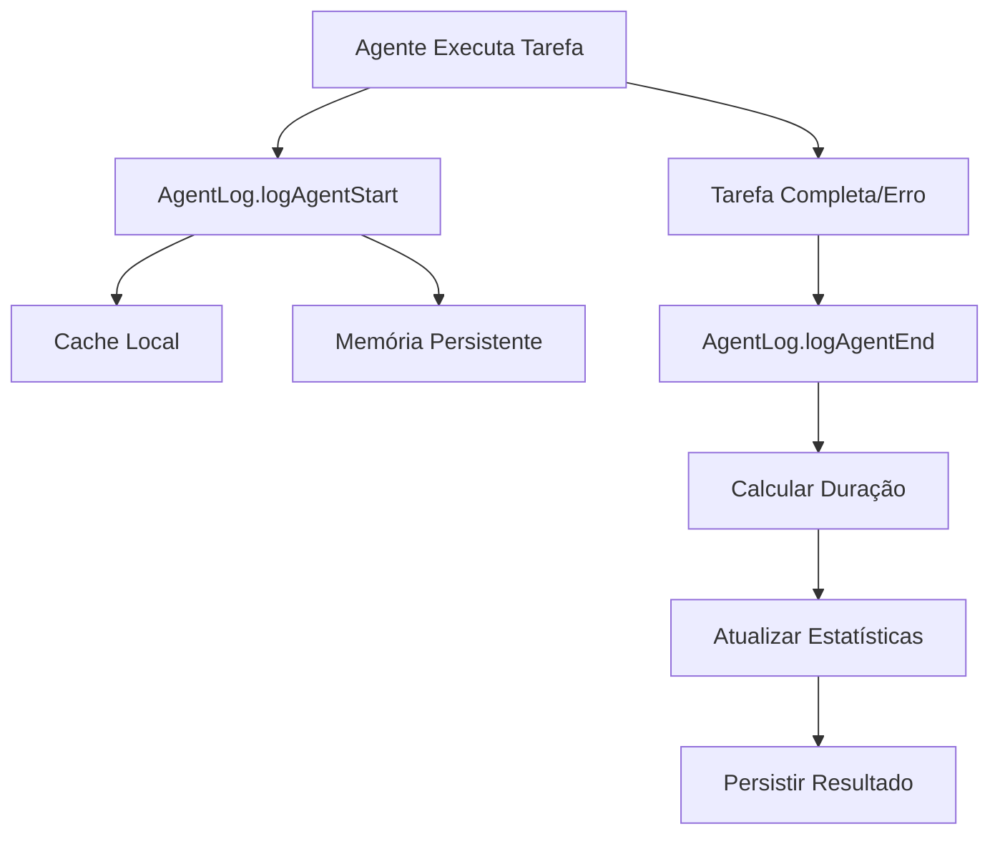
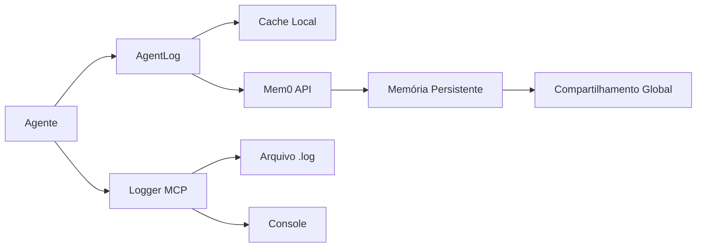

# 📊 Análise Detalhada: Sistema de Logs e Memórias do Guardian

## 📅 /var/lib/docker/volumes/thecryptofrontier-data da Análise: 2025-06-15

## 🎯 Resumo Executivo

O sistema Guardian possui uma arquitetura sofisticada para gerenciamento de logs e memórias, mas atualmente apresenta problemas de integração. A análise revelou:

- **Sistema de Logs**: Implementado com múltiplas camadas (AgentLog, Logger MCP, logs de arquivo)
- **Sistema de Memória**: Integração com Mem0 configurada mas não operacional
- **Organização**: Estrutura bem definida mas com serviços offline

## 1. 🗂️ Sistema de Logs

### 1.1 Arquitetura de Logging

#### **AgentLog System** (`agent-log.ts`)
- **Localização**: `/claude-flow-diego/claude-diego-flow/src/agents/agent-log.ts`
- **Funcionalidades**:
  - Registro de execuções de agentes
  - Análise de performance
  - Estatísticas por tipo de tarefa
  - API REST opcional (porta 3001)
  - Cache local + persistência em memória

```typescript
interface AgentExecutionLog {
  agentName: string;
  agentType: AgentType;
  taskId: string;
  taskDescription: string;
  taskType?: string;
  complexity?: 'simple' | 'medium' | 'complex';
  startTime: Date;
  endTime?: Date;
  duration?: number;
  status: 'started' | 'completed' | 'error';
  error?: string;
  metadata?: Record<string, any>;
}
```

#### **Logger MCP** (`logger.ts`)
- **Localização**: `/claude-flow-diego/mcp-diego-tools/src/utils/logger.ts`
- **Diretório de Logs**: `$LOG_DIR` ou `./logs/`
- **Formato**: `diego-tools-YYYY-MM-DD.log`
- **Níveis**: DEBUG, INFO, WARN, ERROR
- **Saídas**: Console + Arquivo (configurável)

### 1.2 Logs Físicos Encontrados

```
/framework_crewai/post_crew/src/logs/
├── pipeline.log    # Logs do pipeline de blog
└── main.log       # Logs principais do CrewAI
```

### 1.3 Fluxo de Logging



## 2. 💾 Sistema de Memória

### 2.1 Integração Mem0

#### **Configuração**
- **API**: `https://api.mem0.ai/v1`
- **Autenticação**: Bearer token via `MEM0_API_KEY`
- **Bridge HTTP**: Configurado mas offline

#### **Namespaces de Memória**
```typescript
export const MemoryNamespaces = {
  GLOBAL: 'guardian',
  AGENT: (name: string) => `agent:${name.toLowerCase().replace(/\s+/g, '-')}`,
  PROJECT: (name: string) => `project:${name}`,
  TEAM: (name: string) => `team:${name}`,
  WORKFLOW: (name: string) => `workflow:${name}`
}
```

### 2.2 Estrutura de Memória

```typescript
interface AgentMemory {
  remember: (content: string, metadata?: any) => Promise<any>;
  recall: (query: string) => Promise<any>;
  forget: (memoryId: string) => Promise<any>;
  shareWith: (targetUserId: string, content: string) => Promise<any>;
  listMemories: (limit?: number) => Promise<any>;
}
```

### 2.3 Agentes com Memória Aprimorada

1. **Smart Code Scout**
   - Lembra padrões de código
   - Armazena estruturas de projeto
   - Mantém insights de análise

2. **Learning Deploy Bot**
   - Aprende com cada deploy
   - Compartilha insights com Guardian global
   - Busca experiências anteriores

3. **Intelligent Bug Tracker**
   - Identifica padrões em bugs
   - Sugere prevenções
   - Mantém histórico de erros similares

## 3. 📁 Organização de Diretórios

### 3.1 Estrutura de Logs

```
/home/strapi/thecryptofrontier/
├── logs/                              # Diretório principal (quando configurado)
│   └── diego-tools-YYYY-MM-DD.log    # Logs do MCP Diego Tools
├── framework_crewai/post_crew/src/logs/
│   ├── pipeline.log                   # Logs do pipeline
│   └── main.log                       # Logs principais
└── claude-flow-diego/
    └── [logs em memória/cache]        # AgentLog mantém em memória
```

### 3.2 Padrão de Nomenclatura

- **Logs MCP**: `diego-tools-{date}.log`
- **Logs Agent**: Armazenados em memória com IDs únicos
- **Memórias**: Organizadas por namespace (guardian, agent:*, project:*)

## 4. 🔄 Sistema de Integração

### 4.1 Fluxo de Dados



### 4.2 API de Acesso

- **AgentLog API**: Porta 3001 (quando ativa)
  - `/health` - Status do serviço
  - `/stats/:agentName` - Estatísticas do agente
  - `/history/:agentName` - Histórico de execuções
  - `/pipeline-report` - Relatório completo
  - `/agents` - Lista todos os agentes

## 5. 🚨 Problemas Identificados

### 5.1 Serviços Offline

1. **Guardian Service**: Não está respondendo
2. **Mem0 Bridge**: Erro de conexão (`fetch failed`)
3. **API Keys**: Algumas expiradas (ex: Google Gemini)

### 5.2 Limitações Atuais

1. **Rotação de Logs**: Não implementada
2. **Limpeza Automática**: Não configurada
3. **Backup de Memórias**: Sem sistema de backup
4. **Monitoramento**: Sem alertas configurados

## 6. 📈 Análise de Performance

### 6.1 Métricas Coletadas

- **Por Agente**:
  - Total de execuções
  - Última execução
  - Duração média/mín/máx
  - Taxa de sucesso
  - Contagem de erros

- **Por Tarefa**:
  - Tipo e complexidade
  - Estatísticas de duração
  - Taxa de sucesso
  - Estimativas baseadas em histórico

### 6.2 Sistema de Estimativa

```typescript
async estimateTaskDuration(
  taskType: string, 
  complexity: 'simple' | 'medium' | 'complex'
): Promise<{
  estimate: number;
  confidence: number;
  basedOnSamples: number;
}>
```

## 7. 🔧 Recomendações

### 7.1 Melhorias Imediatas

1. **Ativar Serviços**:
   ```bash
   # Iniciar Guardian Service
   cd /home/strapi/thecryptofrontier/claude-flow-diego
   npm run guardian:start
   
   # Iniciar Mem0 Bridge
   npm run mem0:bridge
   ```

2. **Configurar Rotação de Logs**:
   - Implementar rotação diária
   - Limitar tamanho máximo
   - Arquivar logs antigos

3. **Backup de Memórias**:
   - Exportação periódica
   - Sincronização com banco local

### 7.2 Melhorias de Arquitetura

1. **Unificar Sistema de Logs**:
   - Centralizar todos os logs em um único sistema
   - Implementar formato padrão
   - Adicionar correlação de IDs

2. **Melhorar Persistência**:
   - Fallback local quando Mem0 offline
   - Cache mais robusto
   - Sincronização assíncrona

3. **Monitoramento Ativo**:
   - Dashboard de métricas
   - Alertas de falhas
   - Análise de tendências

## 8. 💡 Conclusão

O sistema Guardian possui uma arquitetura robusta e bem pensada para logs e memórias, com:

- ✅ Estrutura modular e extensível
- ✅ Múltiplas camadas de logging
- ✅ Sistema de memória hierárquico
- ✅ API para acesso remoto
- ✅ Análise de performance integrada

Porém, precisa de:
- ❌ Ativação dos serviços offline
- ❌ Implementação de rotação/limpeza
- ❌ Sistema de backup
- ❌ Monitoramento ativo
- ❌ Documentação de troubleshooting

### Próximos Passos

1. Verificar e renovar API keys expiradas
2. Iniciar serviços Guardian e Mem0 Bridge
3. Implementar sistema de rotação de logs
4. Criar dashboard de monitoramento
5. Documentar procedimentos de manutenção

---

*Relatório gerado por análise do código-fonte e estrutura do projeto Guardian*